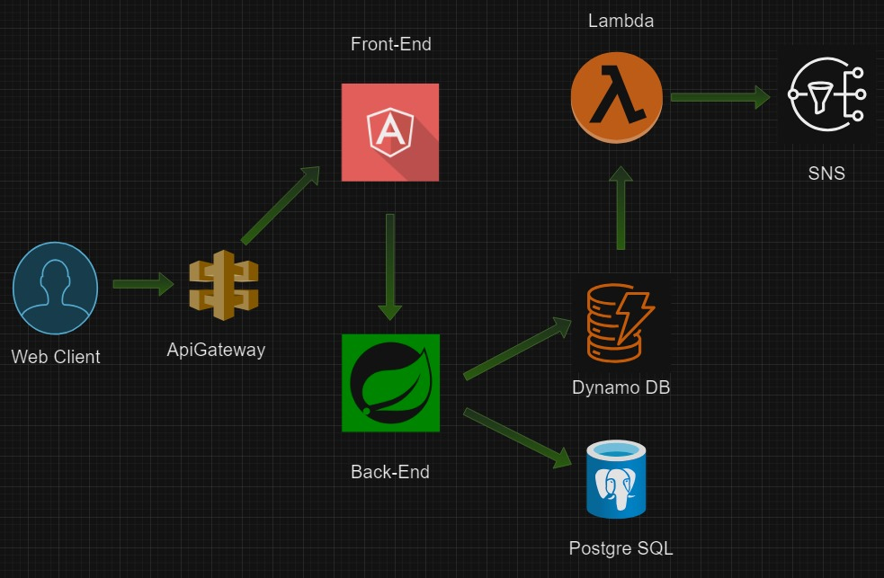

# Entidad financiera

## Descripción:

Está API permite a los usuarios suscribirse a fondos de inversión.
Está construida con Java y Spring Boot, proporcionando endpoints para gestionar clientes, fondos y suscripciones.

## Cómo iniciar el proyecto.

### Construir la imagen:

```docker build -t ahorrafacil .```

### Ejecutar el contenedor:

```docker run -d -p 8080:8080 ahorrafacil```

Esto desplegará la aplicación en el puerto 8080.

## Requisitos para correr el proyecto:

-Java 17 y Postgre 17 

## Sobre el proyecto.

Este proyecto está construido sobre una arquitectura hexagonal que se organiza en tres capas principales.

Capa de dominio
En esta capa se concentran todas las definiciones de negocio, lo que incluye principalmente (pero no exclusivamente) los modelos e interfaces. Aquí se implementan los puertos de entrada y de salida. Los puertos de entrada corresponden a los casos de uso específicos del negocio, mientras que los puertos de salida, que tienden a ser más genéricos, permiten la interacción con servicios externos o infraestructuras. Esta separación asegura una mayor consistencia y flexibilidad en la arquitectura, manteniendo el núcleo del dominio independiente de los detalles externos.

Capa de aplicación
La siguiente capa es la capa de aplicación, donde reside toda la lógica de la aplicación. Esta capa se divide en servicios y casos de uso (usecases). Los casos de uso son implementaciones directas de los puertos de entrada definidos en la capa de dominio, y aquí se maneja la lógica de negocio, como validaciones, consultas, entre otros. Los servicios, por otro lado, actúan como agrupaciones que integran uno o más casos de uso, proporcionando un nivel adicional de organización.

Capa de infraestructura
La capa más externa es la de infraestructura (infra), que es la más extensa en términos de componentes. Aquí se encuentran los controladores (controllers), entidades (entities), repositorios (repositories) y las configuraciones específicas del sistema. Una particularidad de esta capa es que también contiene los adaptadores, los cuales funcionan como puentes entre el proyecto y los sistemas externos, como bases de datos. Aunque en algunas implementaciones los adaptadores se sitúan en una capa más externa, en este caso se integran dentro de infraestructura, dado que su función principal es conectar con bases de datos, las cuales forman parte del ecosistema de infraestructura del proyecto.


## Arquitectura Hexagonal


```
/com/ahorrafacil
│
├── /application
│   ├── /services
│   │   ├── BranchesService.java
│   │   ├── FinancialAccountService.java
│   │   ├── ProductService.java
│   │   └── SubscriptionService.java
│   ├── /usecases
│   │   ├── CreateSubscriptionUseCaseImpl.java
│   │   ├── FindClientUseCaseImplUseCaseImpl.java
│   │   ├── GetFinancialAccountDetailsImpl.java
│   │   ├── ProductsByBranchUseCaseImpl.java
│   │   ├── RetrieveBranchesUseCaseImpl.java
│   │   └── UpdateClientUseCaseImpl.java
│
├── /domain
│   ├── /model
│   │   ├── Branch.java
│   │   ├── Client.java
│   │   ├── FinancialAccount.java
│   │   ├── Product.java
│   │   └── Subscription.java
│   ├── /ports
│   │   ├── /in
│   │   │   ├── FinancialAccountUseCase.java
│   │   │   ├── FindUserByIdentificationUseCase.java
│   │   │   ├── ProductsByBranchUseCase.java
│   │   │   ├── RetrieveBranchesUseCase.java
│   │   │   ├── SubscriptionUseCase.java
│   │   │   └── UpdateClientUseCase.java
│   │   └── /out
│   │       ├── ClientRepositoryPort.java
│   │       ├── FinancialAccountPort.java
│   │       ├── RetrieveBranchesPort.java
│   │       ├── RetrieveProductsRepositoryPort.java
│   │       └── SubscriptionRepositoryPort.java
│
├── /infra
│   ├── /config
│   │   └── ApplicationConfig.java
│   ├── /controllers
│   │   ├── BranchController.java
│   │   ├── ClientController.java
│   │   ├── FinancialAccountController.java
│   │   ├── ProductController.java
│   │   └── SubscriptionController.java
│   ├── /entities
│   │   ├── AvailabilityEntity.java
│   │   ├── BranchEntity.java
│   │   ├── ClientEntity.java
│   │   ├── FinancialAccountEntity.java
│   │   ├── ProductEntity.java
│   │   └── SubscriptionEntity.java
│   ├── /repositories
│   │   ├── JpaAvailabilityRepository.java
│   │   ├── JpaBranchRepository.java
│   │   ├── JpaBranchRepositoryAdapter.java
│   │   ├── JpaClientRepository.java
│   │   ├── JpaClientRepositoryAdapter.java
│   │   ├── JpaFinancialAccountRepository.java
│   │   ├── JpaFinancialAccountRepositoryAdapter.java
│   │   ├── JpaProductRepository.java
│   │   ├── JpaProductRepositoryAdapter.java
│   │   ├── JpaSubscriptionRepository.java
│   │   └── JpaSubscriptionRepositoryAdapter.java
│
└── /test
    ├── ApplicationTests.java
    └── DomainTests.java

```

## Arquitectura en la nube




